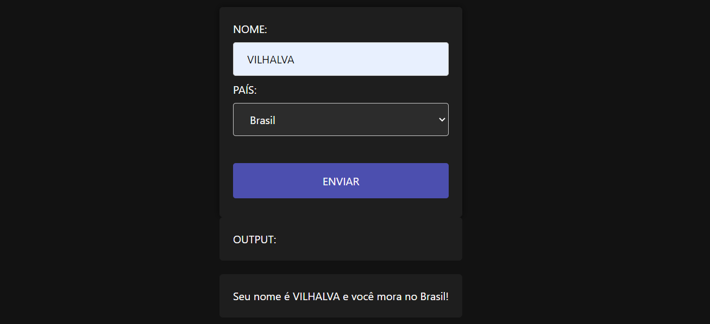

# FORM INPUT E OUTPUT
👨‍🏫FORMULARIO COM CAMPO NOME E PAÍS APENAS COM PYSCRIPT E HTML.

  

## DESCRIÇÃO:
Este projeto é um formulário web interativo desenvolvido utilizando HTML, CSS e PyScript. Ele permite que os usuários insiram seu nome e selecionem um país de uma lista. Quando o botão "ENVIAR" é pressionado, o formulário exibe uma mensagem personalizada com o nome do usuário e o país selecionado.

## EXECUTANDO O PROJETO:
1. **Abrir o Formulário:**
   - Ao abrir a página `./CODIGO/CODIGO.html` no navegador, você verá um formulário centralizado com campos para o nome e a seleção de um país.

2. **Preencher o Formulário:**
   - Insira seu nome no campo de texto indicado como "NOME".
   - Selecione um país da lista de opções fornecidas (Brasil, EUA, Canadá).

3. **Enviar o Formulário:**
   - Clique no botão "ENVIAR".
   - Uma mensagem será gerada e exibida abaixo do botão, indicando o nome inserido e o país selecionado.

## NÃO SABE?
- Entendemos que para manipular arquivos em `HTML`, `CSS` e outras linguagens relacionadas, é necessário possuir conhecimento nessas áreas. Para auxiliar nesse aprendizado, oferecemos cursos gratuitos disponíveis:
* [CURSO DE HTML E CSS](https://github.com/VILHALVA/CURSO-DE-HTML-E-CSS)
* [CURSO DE PYSCRIPT](https://github.com/VILHALVA/CURSO-DE-PYSCRIPT)
* [CONFIRA MAIS CURSOS](https://github.com/VILHALVA?tab=repositories&q=+topic:CURSO)

## CREDITOS:
- [PROJETO FEITO PELO VILHALVA](https://github.com/VILHALVA)
- [VEJA O VIDEO DESSE PROJETO](https://youtu.be/AZ2mUSsgbM0?si=pQi55B6nDhCWlshj)
- [VEJA A PLAYLIST DE PROJETOS](https://youtube.com/playlist?list=PLpdmBGJ6ELUJ2ujkBcMQ3n0D2J2exAVTs&si=ljt5tDj6-IU1Rn7w)

